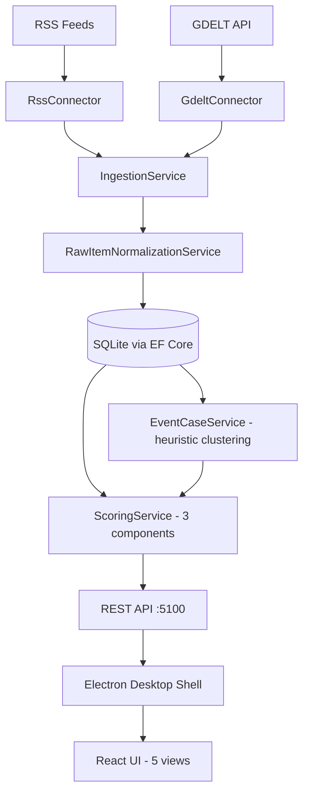

# AegisLoop

**AegisLoop** is a local-first desktop workbench for OSINT analysis.  
It helps analysts ingest RSS/GDELT-like feeds, normalize raw items into observations, rebuild event cases, inspect provenance, apply feedback, calculate explainable confidence scores and export auditable dossiers.

> MVP V1 — desktop analyst workbench with deterministic demo data, local SQLite storage, provenance tracing, audit log and JSON/Markdown exports.


---

## Overview

AegisLoop turns heterogeneous source items into traceable analytical cases:

- Ingest configurable RSS/Atom and GDELT-like sources
- Normalize raw items into observations with deduplication (SHA-256 SourceHash)
- Group observations into event cases via heuristic clustering (lexical overlap, time window)
- Calculate explainable confidence scores (3 components: source reliability, corroboration, analyst feedback)
- Preserve provenance, source hashes and audit entries
- Support analyst feedback (Confirm, Invalidate, Correct, Note)
- Replay a deterministic offline demo dataset
- Export event cases as JSON or Markdown
- Offline map + timeline using Natural Earth public domain vector layers (no external tile service)

## What AegisLoop does NOT do

- No real-time streaming or alerting
- No AI/ML/NLP — all grouping and scoring is heuristic and deterministic
- No authentication, multi-user, or cloud deployment
- No PDF generation, no advanced GIS, no mobile client
- Not an operational intelligence system — human validation is required

---

## Current status

AegisLoop is currently a **solo MVP V1**.  
It is designed as a local desktop workbench, not as a cloud platform, production SOC system or real-time intelligence service.

The project is functional as a reproducible demonstration and local OSINT analysis tool. It is not yet intended for production deployment.

---

## Quick start

### Prerequisites

- **.NET 10 SDK** (10.0.201 or later)
- **Node.js 24+** with npm 11+
- Git

### Clone, build, test

```bash
git clone https://github.com/<your-org>/AegisLoop.git
cd AegisLoop

# Backend
dotnet restore AegisLoop.sln
dotnet build AegisLoop.sln --configuration Release
dotnet test AegisLoop.sln --configuration Release --settings .runsettings

# Frontend
cd src/desktop-electron
npm install
npm run build
npm test
```

### Run the desktop app

From the repository root:

```powershell
.\run.bat desktop
```

Or using the legacy script:

```powershell
.\scripts\run-desktop.bat
```

This spawns the .NET API (port 5100), the Worker, and the Electron window.

To run components individually:

```bash
dotnet run --project src/AegisLoop.Api    # API only → http://localhost:5100
dotnet run --project src/AegisLoop.Worker # Worker only
cd src/desktop-electron && npm run dev    # React dev server only
```

---

## Demo scenario

AegisLoop ships with a deterministic, versioned seed dataset (`v1-seed-2026-04`) that requires no network connectivity.

### Launch and load the seed

```powershell
# 1. Launch the desktop app
.\run.bat desktop
```

1. Open **Paramètres** (Ctrl+5)
2. In the "Mode démo seed/replay V1" section, click **Charger seed**
3. Click **Rebuild EventCases**, then **Recalcul scores**

### Expected volumes

| Metric | Count |
|---|---|
| Connectors | 5 |
| RawItems | 90 |
| Observations | 90 |
| EventCases | 8 |
| Scores | 98 |
| Pre-seeded feedbacks | 5 |
| Scenarios | `aden-maritime-incident`, `sahel-civic-security` |

### Explore the views

| View | Shortcut | What to see |
|---|---|---|
| **Dashboard** | Ctrl+1 | KPIs, high-score events, category/source breakdown, last ingestion |
| **Carte + Timeline** | Ctrl+2 | Natural Earth offline map (110m/50m/10m LOD), timeline, filters, marker selection |
| **EventCase** | Ctrl+3 | Case details, provenance, confidence breakdown, feedback, export |
| **Observations** | Ctrl+4 | Observation list, provenance chain, score impact, feedback submission |
| **Paramètres** | Ctrl+5 | Demo seed controls, audit log, connector configuration |

### Exports

From any EventCase view, click **Exporter JSON** or **Exporter Markdown**.  
Files are saved as `aegisloop-eventcase-<eventCaseId>.json` and `aegisloop-eventcase-<eventCaseId>.md`.

### Reset and replay

1. **Paramètres** → **Reset démo** → **Charger seed**
2. Volumes return to the expected counts deterministically

> Full demo script: [`docs/demo/demo-script-v1.md`](docs/demo/demo-script-v1.md)

---

## Screenshots

| View | Screenshot |
|---|---|
| Dashboard | `docs/assets/dashboard.png` |
| Carte + Timeline | `docs/assets/map-timeline.png` |
| EventCase | `docs/assets/eventcase.png` |
| Observations | `docs/assets/observations.png` |
| Paramètres | `docs/assets/parametres.png` |

---

## Architecture

```
AegisLoop.sln
├── src/
│   ├── AegisLoop.Domain/         # 11 domain entities, enums, constants, interfaces
│   ├── AegisLoop.Application/    # Use cases: ingestion, normalization, scoring, heuristics
│   ├── AegisLoop.Infrastructure/ # EF Core + SQLite, persistence, score/event services
│   ├── AegisLoop.Connectors/     # RSS and GDELT source connectors
│   ├── AegisLoop.Api/            # REST Minimal API (~20 endpoints, localhost:5100)
│   ├── AegisLoop.Worker/         # Background ingestion host
│   └── desktop-electron/         # Electron shell + React + TypeScript + Vite
├── tests/                        # 6 test projects (Domain, Application, Infra, Connectors, API, E2E)
└── docs/                         # Specifications, ADRs, demo script, delivery notes
```



### Tech stack

| Layer | Technology |
|---|---|
| Backend runtime | .NET 10 |
| ORM / DB | EF Core 10 + SQLite |
| Connectors | HttpClient, System.Xml.Linq, System.Text.Json |
| Desktop shell | Electron 41 |
| Frontend UI | React 19, TypeScript 6 |
| Build tool | Vite 8 |
| Testing (back) | xUnit, WebApplicationFactory |
| Testing (front) | Vitest 4, Testing Library |
| Map data | Natural Earth (public domain) |

---

## API / useful endpoints

The REST API listens on `http://localhost:5100` and exposes ~20 endpoints. Key ones:

| Endpoint | Description |
|---|---|
| `GET /health` | Health check |
| `GET /api/observations` | List observations (with filters) |
| `GET /api/observations/{id}` | Observation detail + provenance |
| `GET /api/eventcases` | List event cases |
| `GET /api/eventcases/{id}` | EventCase detail + related observations |
| `POST /api/eventcases/{id}/export?format=json` | Export EventCase as JSON |
| `POST /api/eventcases/{id}/export?format=markdown` | Export EventCase as Markdown |
| `POST /api/demo/reset` | Reset demo state |
| `POST /api/demo/seed` | Load seed dataset |

---

## Documentation map

| Document | Path |
|---|---|
| Functional specifications | [`docs/specs/01-specs-fonctionnelles.md`](docs/specs/01-specs-fonctionnelles.md) |
| Technical architecture | [`docs/specs/02-architecture-technique.md`](docs/specs/02-architecture-technique.md) |
| UI/UX specifications | [`docs/specs/03-specs-ui-ux.md`](docs/specs/03-specs-ui-ux.md) |
| User manual | [`docs/specs/04-manuel-utilisateur.md`](docs/specs/04-manuel-utilisateur.md) |
| Test plan | [`docs/specs/05-plan-de-tests.md`](docs/specs/05-plan-de-tests.md) |
| Demo script | [`docs/demo/demo-script-v1.md`](docs/demo/demo-script-v1.md) |
| ADR — Frontend shell | [`docs/adr/0001-frontend-shell.md`](docs/adr/0001-frontend-shell.md) |
| ADR — Backend modularity | [`docs/adr/0002-backend-modulaire.md`](docs/adr/0002-backend-modulaire.md) |
| ADR — Domain model | [`docs/adr/0003-modele-de-domaine.md`](docs/adr/0003-modele-de-domaine.md) |
| ADR — OSINT connectors | [`docs/adr/0004-strategie-connecteurs-osint.md`](docs/adr/0004-strategie-connecteurs-osint.md) |
| ADR — Persistence strategy | [`docs/adr/0005-strategie-persistance.md`](docs/adr/0005-strategie-persistance.md) |
| ADR — Test strategy | [`docs/adr/0006-strategie-tests.md`](docs/adr/0006-strategie-tests.md) |
| ADR — Security & traceability | [`docs/adr/0007-securite-tracabilite-conformite.md`](docs/adr/0007-securite-tracabilite-conformite.md) |
| Audit report | [`docs/review/00-rapport-audit-global.md`](docs/review/00-rapport-audit-global.md) |
| V1 official definition | [`docs/review/10-mvp-solo-v1-officiel.md`](docs/review/10-mvp-solo-v1-officiel.md) |
| Delivery journal | [`docs/delivery/`](docs/delivery/) |

---

## Security, privacy and ethics

AegisLoop is a **research prototype**, not a production system.

- No authentication, no authorization — local workbench design
- API binds to `localhost`, CORS restricted to Vite dev server
- All demo data is synthetic and non-sensitive
- Scoring is heuristic, not AI — human validation is required
- Natural Earth map data is public domain and for orientation only
- All analyst actions are traced in an append-only audit log
- No telemetry, no external network calls in demo mode

See [`DISCLAIMER.md`](DISCLAIMER.md) and [`SECURITY.md`](SECURITY.md) for full details.

---

## Known limitations

- **Carte + Timeline**: V1 simple offline map with Natural Earth vector layers (110m/50m/10m LOD), SVG-based viewport. No external tile service, no advanced GIS, no clustering, no heatmap, no network geocoding. Natural Earth boundaries are generalized and not suitable for precision decisions.
- **Export PDF**: explicitly excluded from V1.
- **Real-time / SSE**: not demonstrated, excluded from V1.
- **Demo data**: simulated and non-sensitive. Counters include default system connectors; demo status displays the 5 local seed connectors.
- **EventCase `Note` feedback**: neutral by design; use `Confirm`, `Correct` or `Invalidate` to show score variation.
- **No NLP / entity linking**: entity detection is dictionary + regex based in V1.
- **No multi-analyst collaboration**: single local workstation only.

---

## Roadmap

### V1 (current)

- [x] RSS + GDELT ingestion
- [x] RawItems → Observations normalization + dedup
- [x] EventCase heuristic clustering
- [x] 3-component explainable scoring
- [x] Analyst feedback loop
- [x] Provenance tracking
- [x] Append-only audit
- [x] JSON + Markdown export
- [x] Demo seed/replay mode
- [x] Offline map + timeline (Natural Earth LOD)
- [x] Electron desktop shell

### Future (aspirational)

- NLP-based entity extraction
- Additional connectors (Twitter, Telegram, custom APIs)
- Real-time streaming
- Multi-analyst collaboration
- PDF report generation
- Containerized deployment

---

## Contributing

AegisLoop is a solo MVP. Contributions, feedback and bug reports are welcome.

1. Fork the repository
2. Create a feature branch (`git checkout -b feature/your-feature`)
3. Commit your changes (`git commit -m 'Add your feature'`)
4. Push to the branch (`git push origin feature/your-feature`)
5. Open a Pull Request

Please ensure tests pass before submitting:

```powershell
.\scripts\test.bat
```

For major changes, please open an issue first to discuss what you would like to change.

---

## License

AegisLoop is licensed under the GNU Affero General Public License v3.0 (AGPL-3.0).  
See the [`LICENSE`](LICENSE) file for the full license text.

---

## Data sources

| Source | Type | Attribution |
|---|---|---|
| RSS/Atom feeds | Configured by user | Feed publisher |
| GDELT API v2 | Public OSINT | [GDELT Project](https://www.gdeltproject.org/) |
| Natural Earth | Vector map data | Public domain — [naturalearthdata.com](https://www.naturalearthdata.com/) |
| Demo seed | Synthetic fixture | `examples/demo-data/v1-seed.json` |