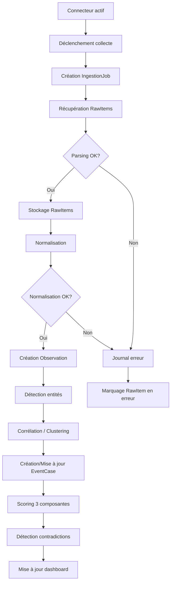
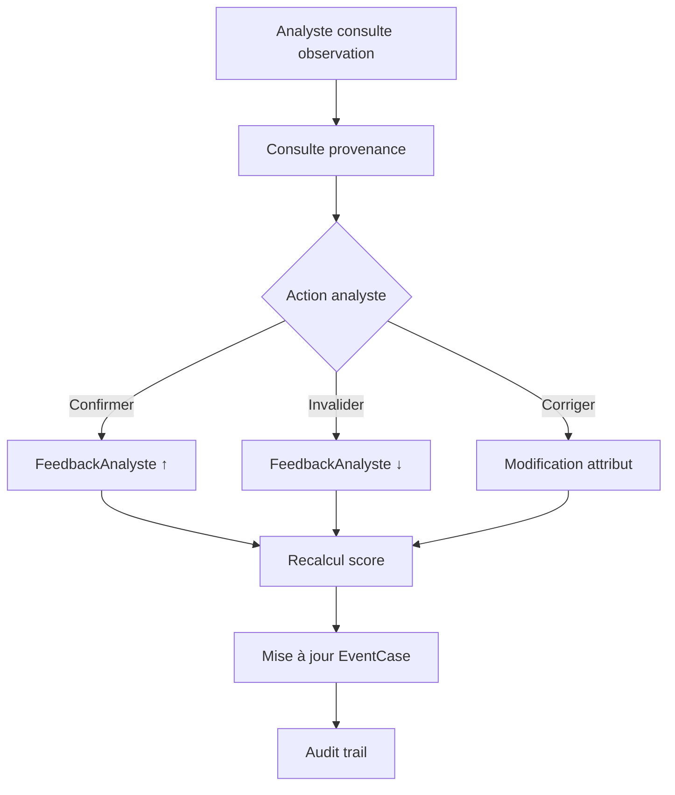
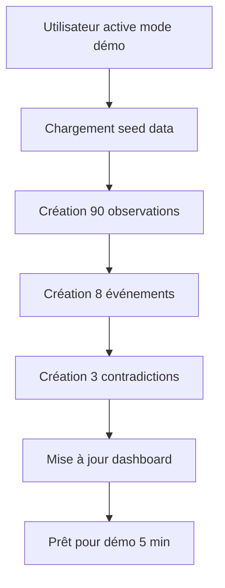

# Aegis Loop — Spécifications fonctionnelles

> **Version :** 2.0  
> **Statut :** Aligné V1 officielle — Spec-first  
> **Dernière mise à jour :** 2026-04-23  
> **Lien vers progression :** [01-specs-fonctionnelles.progress.md](01-specs-fonctionnelles.progress.md)  
> **Document amont :** [10-mvp-solo-v1-officiel.md](../review/10-mvp-solo-v1-officiel.md)  
> **Note :** Ce document est strictement aligné sur la V1 officielle. Tout écart est une erreur.

---

## 1. Acteurs et rôles

### 1.1 Acteurs identifiés

| Acteur | Description | Rôle dans le système |
|---|---|---|
| **Analyste** | Utilisateur principal du workbench desktop | Configure, explore, valide, corrige, exporte |
| **Système (automate)** | Pipeline d'ingestion, fusion, scoring en arrière-plan | Collecte, normalise, corrèle, score, détecte |
| **Connecteur OSINT** | Module logiciel interfaçant une source externe | Fournit des RawItems au pipeline |
| **Source externe** | Flux RSS ou API publique | Productrice de données brutes |
| **Administrateur local** | Même personne que l'analyste en contexte solo | Configure les connecteurs, gère le mode démo |

> **Hypothèse V1 :** L'analyste et l'administrateur local sont la même personne. MVP solo, pas de multi-utilisateur.

---

## 2. Cas d'usage V1

> **Alignement V1 :** Seuls les cas d'usage compatibles avec RSS + GDELT et les 17 items du backlog sont listés. Les cas d'usage YouTube, STAC, Import manuel, Watchlists et Recherche avancée sont repoussés en V2.

### 2.1 CU-01 — Configurer un connecteur OSINT

**Acteur :** Analyste / Administrateur local  
**Précondition :** Application lancée, connecteur disponible  
**Postcondition :** Connecteur configuré et prêt à collecter

**Flux nominal :**
1. L'analyste ouvre la vue "Paramètres" (Ctrl+5), onglet connecteurs
2. Il sélectionne un type de connecteur (RSS ou GDELT)
3. Il renseigne les paramètres requis (URL du flux / requête et filtres)
4. Il active le connecteur
5. Le système valide la configuration (connectivité, format)
6. Le connecteur est enregistré et apparaît comme "Actif"

**Flux alternatifs :**
- 3a. Paramètres invalides → message d'erreur explicite, champ surligné
- 5a. Source injoignable → avertissement, possibilité de réessayer ou de sauvegarder en "Inactif"

**Critères d'acceptation :**
- Chaque type de connecteur a un formulaire dédié avec validation
- Un connecteur peut être activé/désactivé sans perdre sa configuration
- La configuration est persistée localement
- Pas de clé API requise pour RSS ni GDELT

---

### 2.2 CU-02 — Lancer une collecte manuelle

**Acteur :** Analyste  
**Précondition :** Au moins un connecteur actif  
**Postcondition :** Nouvelles observations collectées et normalisées

**Flux nominal :**
1. L'analyste déclenche une collecte manuelle (bouton ou via l'API)
2. Le système exécute les connecteurs actifs dans l'ordre de priorité
3. Chaque connecteur récupère les nouveaux éléments depuis la dernière collecte
4. Les RawItems sont créés et stockés
5. Le pipeline de normalisation traite les RawItems
6. Les observations normalisées sont créées et corrélées
7. Le dashboard est mis à jour

**Flux alternatifs :**
- 3a. Source temporairement indisponible → retry avec backoff exponentiel (1-2-4-8-16s), circuit breaker après 3 échecs/5min, pas de blocage des autres connecteurs
- 4a. RawItem en doublon → déduplication par hash (SourceHash), conservation du plus récent
- 5a. Échec de normalisation → RawItem marqué en erreur, journal, pas de crash

**Critères d'acceptation :**
- La collecte ne bloque jamais l'interface
- Chaque connecteur peut échouer indépendamment sans impact sur les autres
- Les doublons sont détectés et gérés
- L'analyste voit la progression de la collecte

---

### 2.3 CU-03 — Explorer le dashboard

**Acteur :** Analyste  
**Précondition :** Observations collectées  
**Postcondition :** L'analyste a une vue synthétique de la situation

**Flux nominal :**
1. L'analyste ouvre la vue "Dashboard" (Ctrl+1)
2. Le système affiche les KPIs, événements prioritaires, contradictions, activité connecteurs
3. L'analyste peut filtrer par période, source, score de confiance
4. L'analyste clique sur un événement pour accéder au détail

**Critères d'acceptation :**
- Le dashboard se charge en moins de 2 secondes avec les données de démo
- Les événements sont triés par priorité (score de confiance × corroboration)
- Les contradictions sont visuellement mises en évidence
- Un résumé numérique (compteurs) est toujours visible

---

### 2.4 CU-04 — Consulter un événement (EventCase)

**Acteur :** Analyste  
**Précondition :** Événement existant  
**Postcondition :** L'analyste a exploré le détail de l'événement

**Flux nominal :**
1. L'analyste sélectionne un événement depuis le dashboard ou la carte
2. Le système affiche la vue "EventCase" (Ctrl+3) avec :
   - Résumé de l'événement
   - Observations associées avec provenance
   - Entités liées (lieux, organisations, personnes)
   - Score de confiance global et par observation (3 composantes décomposables)
   - Contradictions identifiées (onglet dédié)
   - Notes et tags existants
   - Bouton d'export Markdown/JSON
3. L'analyste explore les observations, vérifie la provenance
4. L'analyste peut ajouter une note, un tag, valider ou corriger

**Critères d'acceptation :**
- Toute information affichée a une provenance accessible en un clic
- Le score de confiance est décomposable (FiabilitéSource, Corroboration, FeedbackAnalyste)
- Les contradictions sont listées dans un onglet dédié et cliquables
- L'ajout de note/tag est immédiat (pas de rechargement)

---

### 2.5 CU-05 — Valider ou corriger une observation

**Acteur :** Analyste  
**Précondition :** Observation existante  
**Postcondition :** Feedback analyste enregistré, scoring ajusté

**Flux nominal :**
1. L'analyste sélectionne une observation
2. Il consulte la provenance complète (source, date de collecte, transformations)
3. Il choisit une action :
   - **Confirmer** — L'observation est validée, le FeedbackAnalyste augmente
   - **Invalider** — L'observation est marquée incorrecte, le score diminue
   - **Corriger** — L'analyste modifie un attribut (lieu, date, description)
4. Le système enregistre le feedback (AnalystFeedback, immutable après 5 min)
5. Le système ajuste le scoring de l'observation (les 3 composantes)
6. L'audit trail est mis à jour

**Flux alternatifs :**
- 3c. Correction sur un champ non modifiable → message d'erreur
- 5. Le scoring ajusté peut changer la priorité de l'événement parent

**Critères d'acceptation :**
- Chaque action de feedback est tracée (qui, quand, quoi)
- Le scoring est re-calculé après feedback
- L'analyste peut annuler son dernier feedback dans les 5 minutes
- Le feedback est visible dans la timeline de l'événement

---

### 2.6 CU-06 — Gérer les contradictions (simplifié V1)

**Acteur :** Système (détection) + Analyste (résolution)  
**Précondition :** Au moins deux observations contradictoires  
**Postcondition :** Contradiction identifiée et actionnée

**Flux nominal :**
1. Le système détecte une contradiction entre observations (même sujet, affirmations divergentes)
2. La contradiction est enregistrée et liée aux observations
3. Elle apparaît sur le dashboard et dans l'onglet contradictions de l'EventCase
4. L'analyste consulte la contradiction
5. Il voit les observations en conflit avec leur provenance respective
6. Il décide :
   - **Confirmer l'une** — L'autre est marquée "contredite"
   - **Les garder en suspens** — La contradiction reste ouverte

**Règles métier V1 :**
- Une contradiction est détectée quand deux observations portent sur le même sujet et affirment des faits incompatibles
- Types V1 : temporelle, factuelle, géographique (pas de type "fiabilité" séparé en V1)
- Le score de confiance d'une observation contredite est réduit
- L'analyste a toujours le dernier mot
- Pas de workflow de résolution complexe en V1, pas d'historique de résolution

**Critères d'acceptation :**
- Les contradictions sont détectées automatiquement après ingestion
- L'analyste peut résoudre une contradiction en moins de 3 clics
- Toute action est tracée

---

### 2.7 CU-07 — Consulter la provenance

**Acteur :** Analyste  
**Précondition :** Observation existante  
**Postcondition :** L'analyste connaît l'origine complète de l'information

**Flux nominal :**
1. L'analyste clique sur l'icône "Provenance" d'une observation
2. Le système affiche la chaîne de provenance complète :
   - Source connecteur (RSS ou GDELT)
   - URL originale / identifiant de la source
   - Date de collecte
   - Date de publication originale
   - Transformations appliquées (normalisation)
   - Score de fiabilité de la source
3. L'analyste peut naviguer vers la source originale (si URL disponible)

**Critères d'acceptation :**
- La chaîne de provenance est complète et non modifiable
- L'URL originale est cliquable (ouverture dans le navigateur)
- L'historique des feedbacks analyste est inclus
- La provenance est incluse dans les exports

---

### 2.8 CU-08 — Exporter un dossier événement

**Acteur :** Analyste  
**Précondition :** EventCase existant avec contenu  
**Postcondition :** Rapport généré dans le format choisi

**Flux nominal :**
1. L'analyste ouvre un EventCase
2. Il clique sur le bouton "Exporter" (ou Ctrl+E)
3. Il choisit le format : Markdown ou JSON
4. Le système génère le rapport
5. L'analyste le télécharge à l'emplacement choisi

**Critères d'acceptation :**
- Export Markdown complet avec provenance et scores
- Export JSON structuré conforme au schéma AegisLoop
- L'export préserve la traçabilité
- PDF repoussé en V2

---

### 2.9 CU-09 — Filtrer les observations

**Acteur :** Analyste  
**Précondition :** Données collectées  
**Postcondition :** Résultats filtrés affichés

**Flux nominal :**
1. L'analyste ouvre la vue "Observations" (Ctrl+4)
2. Il utilise la barre de filtres : période, source, type, score de confiance, tags
3. Le système affiche les résultats filtrés
4. L'analyste peut utiliser la recherche rapide (Ctrl+K)

**Critères d'acceptation :**
- Filtres combinables par source, date, score, type
- Recherche rapide par texte (Ctrl+K)
- Pas de recherche avancée en V1 (repoussée V2)
- Pas de sauvegarde de requêtes en V1

---

### 2.10 CU-10 — Activer le mode démo

**Acteur :** Analyste / Administrateur local  
**Précondition :** Application lancée  
**Postcondition :** Données de démonstration chargées

**Flux nominal :**
1. L'analyste active le mode démo depuis les paramètres (Ctrl+5)
2. Le système charge les datasets seed intégrés
3. Les données de démo sont visibles dans toutes les vues
4. L'analyste peut utiliser toutes les fonctionnalités V1 sur les données de démo

**Règles métier :**
- Les données de démo sont clairement marquées "DÉMO"
- Elles couvrent exactement 2 scénarios concrets
- Le mode démo peut être réinitialisé via `/api/demo/reset`
- Les données de démo sont séparées des données réelles

**Critères d'acceptation :**
- Le mode démo se charge en moins de 5 secondes
- Exactement 2 scénarios : Crise au Soudan + Incident maritime Golfe d'Aden
- Aucune dépendance réseau en mode démo
- 90 observations, 8 événements, 3 contradictions au total

---

### 2.11 CU-11 — Consulter la carte et la timeline

**Acteur :** Analyste  
**Précondition :** Observations avec composante géographique ou temporelle  
**Postcondition :** Visualisation spatio-temporelle

**Flux nominal :**
1. L'analyste ouvre la vue "Carte + Timeline" (Ctrl+2)
2. La carte affiche les observations géolocalisées (marqueurs, clusters)
3. La timeline simple affiche la distribution temporelle
4. L'analyste peut filtrer par période (sélection sur la timeline)
5. L'analyste peut cliquer sur un marqueur pour voir l'observation
6. Les clusters spatio-temporels sont mis en évidence

**Critères d'acceptation :**
- Rendu fluide avec les données de démo
- Zoom et déplacement fluides
- Tooltip au survol des marqueurs
- Couches cartographiques OpenStreetMap par défaut
- Timeline simple (pas de timeline avancée en V1)

---

### 2.12 CU-12 — Annoter (tags et notes)

**Acteur :** Analyste  
**Précondition :** Observation ou événement existant  
**Postcondition :** Annotation ajoutée

**Flux nominal :**
1. L'analyste sélectionne une observation ou un événement
2. Il ajoute un tag ou une note
3. L'annotation est enregistrée immédiatement et tracée

**Règles métier V1 :**
- Tags : étiquettes courtes attachées à n'importe quel élément
- Notes : texte libre attaché à une observation ou un événement
- Les annotations sont horodatées

**Critères d'acceptation :**
- Ajout de note en moins de 3 clics
- Tags appliqués en 1 clic
- Watchlists repoussées en V2

---

## 3. Fonctionnalités détaillées V1

### 3.1 F-01 — Modèle de domaine (BL-01)

**Objectif :** Définir les 11 types du domaine V1 avec leurs invariants.

**Types V1 :**

| Type | Responsabilité | V1 |
|---|---|---|
| **SourceConnector** | Connecteur configuré et actif (inclut Config) | ✅ Must |
| **RawItem** | Donnée brute avant normalisation | ✅ Must |
| **Observation** | Unité normalisée — centre de gravité du domaine | ✅ Must |
| **Entity** | Entité nommée extraite (Location, Org, Person) | ✅ Must |
| **EventCase** | Événement / dossier regroupant des observations | ✅ Must |
| **Location** | Coordonnées géographiques | ✅ Must |
| **Contradiction** | Conflit entre observations (simplifié) | ✅ Must |
| **ConfidenceScore** | Score explicable à 3 composantes | ✅ Must |
| **AnalystFeedback** | Action de l'analyste (append-only après fenêtre) | ✅ Must |
| **AuditEntry** | Entrée du journal d'audit | ✅ Must |
| **IngestionJob** | Trace d'une exécution de connecteur | ✅ Must |

**Types exclus V1 (repoussés V2/V3) :** Claim (→ champ `ClaimText` dans Observation), Evidence (→ Observation = preuve en V1), MediaAsset (V2 avec YouTube), SearchQuery (V2), EntityLink (V2), Watchlist (V2), ReportExport (→ DTO Application), ConnectorConfiguration (→ propriétés de SourceConnector).

**Invariants métier V1 :**
1. Un EventCase doit avoir au moins 1 Observation
2. ConfidenceScore.Value ∈ [0.0, 1.0]
3. Un RawItem a toujours un SourceHash non vide
4. Toute Observation est liée à un RawItem ou marquée manuelle
5. Un AnalystFeedback est immutable après la fenêtre d'annulation (5 min)
6. AuditEntry est append-only, jamais modifié ni supprimé
7. Contradiction : Observation1Id ≠ Observation2Id
8. Location : Latitude ∈ [-90, 90], Longitude ∈ [-180, 180]
9. Un SourceConnector actif a toujours une configuration valide
10. Le score d'un EventCase est la moyenne pondérée des scores de ses Observations × FacteurCorroboration

---

### 3.2 F-02 — Connecteur RSS/Atom (BL-02)

**Objectif :** Collecter les données depuis des flux RSS/Atom publics.

**Paramètres :**
| Paramètre | Description | Défaut |
|---|---|---|
| URL du flux | URL du flux RSS/Atom | — |
| Fréquence de polling | Intervalle entre les collectes | 15 min |
| Nombre max d'items | Limite par collecte | 500 |

**Rate limiting :** 1 requête toutes les 15 minutes minimum par flux. Respect du `ETag` et `Last-Modified` pour les requêtes conditionnelles.

**Retry :** Exponentiel 1-2-4-8-16s, circuit breaker après 3 échecs consécutifs sur 5 minutes.

**Critères d'acceptation :**
- Collecte les titres, contenus, dates, auteurs, URLs
- Gère les formats RSS 2.0 et Atom
- Déduplication par SourceHash
- Ne crash jamais si le flux est malformé

---

### 3.3 F-03 — Connecteur GDELT (BL-03)

**Objectif :** Collecter les événements géolocalisés depuis GDELT API v2.

**Paramètres :**
| Paramètre | Description | Défaut |
|---|---|---|
| Requête | Filtres pays/thème | — |
| Filtre pays | Code pays ISO | — |
| Filtre thème | Catégorie GDELT | — |
| Fréquence de polling | Intervalle entre les collectes | 30 min |

**Rate limiting :** Maximum 60 requêtes/minute (marge de sécurité vs. limite API de 360/min). Respect du quota GDELT.

**Retry :** Exponentiel 1-2-4-8-16s, circuit breaker après 3 échecs consécutifs sur 5 minutes.

**Critères d'acceptation :**
- Collecte les événements géolocalisés avec coordonnées
- Gère les formats GDELT CSV/JSON
- Extrait les ActorXX fields pour les entités
- Ne crash jamais si l'API retourne des erreurs

---

### 3.4 F-04 — Pipeline ingestion (BL-04)

**Objectif :** Orchestrer la collecte, normalisation et corrélation.

**Pipeline :**
1. **Collecte** — Connecteur actif → RawItems
2. **Normalisation** — RawItem → Observation (mapping, enrichissement, déduplication)
3. **Fusion/correlation** — Observation → EventCase (clustering)
4. **Scoring** — Calcul des scores de confiance (3 composantes)
5. **Détection contradictions** — Comparaison intra-EventCase

**Règles métier :**
- Le pipeline est non-bloquant — il ne fige pas l'interface
- Chaque collecte crée un `IngestionJob` avec horodatage et statut
- La déduplication est faite par hash (sha256 du contenu normalisé + source)
- En cas d'erreur, les items déjà collectés sont préservés

---

### 3.5 F-05 — Normalisation (BL-05)

**Objectif :** Transformer les RawItems en Observations conformes au modèle de domaine.

**Pipeline de normalisation :**
1. **Parsing** — Extraction du contenu brut selon le format source
2. **Mapping** — Projection vers le modèle `Observation`
3. **Enrichissement initial** — Détection d'entités (dictionnaire + regex), géocodage
4. **Horodatage** — Normalisation des dates au format ISO 8601 UTC
5. **Déduplication** — Comparaison avec les observations existantes

**Règles métier :**
- Chaque RawItem produit 0 ou 1 Observation (V1 simplifié)
- Une Observation normalisée préserve le lien vers le RawItem source
- Les champs non mappables sont conservés dans un dictionnaire `Metadata` extensible
- La normalisation est idempotente
- Les échecs de normalisation sont journalisés

---

### 3.6 F-06 — Détection d'entités (BL-06)

**Objectif :** Identifier les entités nommées dans les observations.

**Types d'entités V1 :**
- `Location` — Lieu géographique (pays, ville, région)
- `Organization` — Organisation, institution, groupe
- `Person` — Personne nommée (prénom + nom)

**Méthode V1 :**
- Dictionnaire de termes géographiques (geonames_lite intégré)
- Patterns regex pour les entités nommées
- Correspondance avec les données GDELT (ActorXX fields)

> **Exclus V1 :** EntityLink (relations typées entre entités) repoussé en V2. Les types Event et Keyword comme entités sont exclus — les événements sont des EventCase.

---

### 3.7 F-07 — Fusion/correlation (BL-07)

**Objectif :** Regrouper les observations en événements cohérents.

**Méthode V1 — Clustering heuristique :**
1. Les observations sont groupées par :
   - Proximité temporelle (fenêtre configurable, défaut : 24h)
   - Proximité géographique (rayon configurable, défaut : 50km)
   - Similarité textuelle (seuil configurable)
   - Entités communes (même lieu, même organisation)
2. Les groupes qui dépassent un seuil de corroboration (≥ 2 observations, ≥ 2 sources) deviennent des événements
3. Les événements sont consolidés avec un résumé synthétique

**Règles métier :**
- Un événement a un score de corroboration (nombre de sources indépendantes)
- Un événement a un score de confiance (combinaison des scores de ses observations)
- Les événements sont dynamiques — de nouvelles observations peuvent les renforcer

---

### 3.8 F-08 — Scoring heuristique (BL-08)

**Objectif :** Attribuer un score de confiance explicable à chaque observation et événement.

**Modèle de scoring V1 — 3 composantes :**

```
Score = W1 × FiabilitéSource + W2 × Corroboration + W3 × FeedbackAnalyste
```

| Composante | Plage | Poids défaut | Description |
|---|---|---|---|
| FiabilitéSource | 0.0–1.0 | 0.35 | Score de la source (configurable par type) |
| Corroboration | 0.0–1.0 | 0.35 | Nombre de sources indépendantes confirmant |
| FeedbackAnalyste | 0.0–1.0 | 0.30 | Validation/correction par l'analyste |

**FiabilitéSource par défaut (V1) :**

| Type de source | Score par défaut |
|---|---|
| Institutionnel (.gov, .mil, ONU) | 0.85 |
| Média établi (Reuters, AP, etc.) | 0.75 |
| Média régional | 0.60 |
| GDELT (agrégateur) | 0.55 |
| Inconnu | 0.30 |

> **Exclus V1 :** Fraîcheur (→ tri, pas un score de confiance), Complétude/Spécificité (trop subjectif à calibrer). YouTube (0.40) et Import manuel (0.50) exclus car connecteurs V2.

**Pour un événement :**
```
ScoreÉvénement = MoyennePondérée(ScoresObservations) × FacteurCorroboration
```
- FacteurCorroboration = min(1.0, SourcesIndépendantes / 3)
- 3 sources indépendantes = facteur 1.0

**Règles métier :**
- Le score est toujours dans [0.0, 1.0]
- Le score est recalculé après chaque feedback analyste
- Le score est décomposable — l'analyste peut voir chaque composante
- Les poids sont configurables dans les Paramètres
- Le score est explicable par construction

---

### 3.9 F-09 — Dashboard (BL-09)

**Objectif :** Vue synthétique des KPIs, événements prioritaires, contradictions.

**Contenu :**
- Compteurs clés (observations, événements, contradictions, connecteurs actifs)
- Événements prioritaires triés par score
- Contradictions récentes avec indicateur visuel
- Activité des connecteurs (statut, dernière collecte)

---

### 3.10 F-10 — Vue EventCase (BL-10)

**Objectif :** Détail d'un événement avec observations, provenance, score, contradictions.

**Contenu :**
- Résumé de l'événement
- Liste des observations avec provenance
- Score de confiance décomposable (3 composantes cliquables)
- Onglet contradictions
- Bouton d'export Markdown/JSON
- Zone de notes/tags

---

### 3.11 F-11 — Feedback analyste (BL-11)

**Objectif :** Permettre à l'analyste de valider, invalider ou corriger une observation.

**Actions V1 :**
- **Confirmer** — Augmente FeedbackAnalyste
- **Invalider** — Diminue FeedbackAnalyste
- **Corriger** — Modifie un attribut + diminue légèrement FeedbackAnalyste

**Règles métier :**
- Tout feedback est tracé (AnalystFeedback)
- Le feedback est immutable après 5 minutes (fenêtre d'annulation)
- Le scoring est recalculé après chaque feedback
- L'audit trail est mis à jour

---

### 3.12 F-12 — Mode démo + seed data (BL-12)

**Objectif :** Permettre une démonstration complète sans dépendance réseau.

**Scénario 1 — Crise au Soudan :**
- 50 observations de 3 sources (RSS LeMonde, RSS BBC, GDELT)
- 5 événements : Combats Khartoum, Déplacement populations, Coupure humanitaire, Déclarations diplomatiques, Incertitude sur le bilan
- 2 contradictions : Bilan humain divergent, Localisation des combats

**Scénario 2 — Incident maritime Golfe d'Aden :**
- 40 observations de 2 sources (RSS maritime, GDELT maritime)
- 3 événements : Attaque navire commerce, Réponse internationale, Trafic maritime dévié
- 1 contradiction : Nature de l'attaque (missile vs drone)

**Total seed :** 90 observations, 8 événements, 3 contradictions.

---

### 3.13 — Export Markdown/JSON (BL-13, Should)

**Objectif :** Exporter un dossier événement en Markdown ou JSON.

**Formats V1 :**

| Format | Contenu | Priorité |
|---|---|---|
| Markdown | Rapport textuel structuré avec provenance et scores | Should |
| JSON | Export structuré complet (schéma AegisLoop) | Should |

> **Exclus V1 :** Export PDF repoussé en V2.

---

### 3.14 — Audit trail (BL-14, Should)

**Objectif :** Tracer toutes les actions du système et de l'analyste.

**Événements journalisés :**
| Catégorie | Exemples |
|---|---|
| Ingestion | Démarrage/fin de collecte, nombre d'items, erreurs |
| Normalisation | Items traités, succès/échecs |
| Corrélation | Événements créés/fusionnés |
| Scoring | Calculs de score |
| Analyste | Feedback, exports |
| Configuration | Activation/désactivation de connecteur |

**Règles métier :**
- Append-only, jamais modifié ni supprimé
- Persisté dans SQLite
- Consultable et exportable en JSON

---

### 3.15 — Tags/notes simples (BL-15, Should)

**Objectif :** Permettre à l'analyste d'annoter les observations et événements.

**Tags :** Étiquettes courtes attachées à n'importe quel élément. Filtrage par tags.

**Notes :** Texte libre attaché à une observation ou un événement. Horodatage et auteur.

> **Exclus V1 :** Watchlists repoussées en V2.

---

### 3.16 — Contradictions — Détection et affichage (BL-16, Should)

**Objectif :** Détecter automatiquement et afficher les contradictions entre observations.

**Algorithme V1 :**
1. Quand une nouvelle observation est ajoutée à un événement
2. Comparer avec les observations existantes du même événement
3. Si des attributs clés (lieu, date, fait principal) sont incompatibles → créer une Contradiction
4. Afficher dans l'onglet contradictions de l'EventCase
5. L'analyste résout manuellement

**Types V1 :** Temporelle, Factuelle, Géographique.

> **Simplifié V1 :** Pas de workflow de résolution complexe, pas de types multiples au-delà de ces 3, pas d'historique de résolution.

---

### 3.17 — Configuration connecteurs (BL-17, Should)

**Objectif :** Formulaire de configuration dans Paramètres.

**Contenu :**
- Formulaire RSS : URL du flux, fréquence de polling
- Formulaire GDELT : requête, filtres pays/thème, fréquence
- Activation/désactivation par connecteur
- Statut visible (actif, inactif, en erreur)

---

## 4. Backlog V1 officiel (17 items)

### 4.1 Must (12 items)

| ID | Fonctionnalité | Description |
|---|---|---|
| BL-01 | Modèle de domaine | 11 types, invariants explicites, interfaces clés |
| BL-02 | Connecteur RSS/Atom | Collecte, polling, rate limiting, retry |
| BL-03 | Connecteur GDELT | Collecte, filtrage pays/thème, rate limiting, retry |
| BL-04 | Pipeline ingestion | Collecte → RawItem → Normalisation → Observation |
| BL-05 | Normalisation | Mapping vers Observation unifiée, Metadata extensible |
| BL-06 | Détection d'entités | Dictionnaire + regex, Entity basique |
| BL-07 | Fusion/correlation | Clustering temporel + géographique + similarité textuelle |
| BL-08 | Scoring heuristique | 3 composantes : FiabilitéSource, Corroboration, FeedbackAnalyste |
| BL-09 | Dashboard | KPIs, événements prioritaires, contradictions |
| BL-10 | Vue EventCase | Détail événement, observations, provenance, score, contradictions |
| BL-11 | Feedback analyste | Confirmer/invalider/corriger, recalcul du score |
| BL-12 | Mode démo + seed data | 2 scénarios embarqués, sans réseau |

### 4.2 Should (5 items)

| ID | Fonctionnalité | Description |
|---|---|---|
| BL-13 | Export Markdown/JSON | Export de dossier événement |
| BL-14 | Audit trail | Journal append-only des actions |
| BL-15 | Tags/notes simples | Annotation basique sur observations et événements |
| BL-16 | Contradictions — Détection et affichage | Détection automatique + onglet dans EventCase |
| BL-17 | Configuration connecteurs | Formulaire de configuration dans Paramètres |

### 4.3 Exclus V1 (repoussés V2/V3)

| Fonctionnalité | Destination | Raison |
|---|---|---|
| Connecteur YouTube | V2 | Quota API, CGU, complexité |
| Connecteur STAC | V2 | Valeur démo limitée sans images |
| Import manuel | V2 | Pas critique pour la démo |
| Watchlists | V2 | Complexe à implémenter correctement |
| Export PDF | V2 | Complexité de génération |
| Timeline avancée | V2 | Composant lourd |
| Recherche avancée | V2 | Filtres simples suffisent en V1 |
| Active learning | V3 | Prématuré |
| NLP/entity linking | V3 | Prématuré |
| Plugins connecteurs | V3 | Pas de besoin en V1 |

---

## 5. États et transitions V1

### 5.1 Cycle de vie d'une Observation

```
RawItem → [Normalisation] → Observation
Observation états :
  Nouvelle → Confirmée | Invalidée | Contredite
```

### 5.2 Cycle de vie d'un EventCase

```
Détecté → Confirmé → En cours → Clôturé → Archivé
           ↘ Invalidé
```

### 5.3 Cycle de vie d'un SourceConnector

```
Configuré → Actif → En pause → Inactif
              ↘ En erreur → Actif (après retry)
```

### 5.4 Cycle de vie d'un IngestionJob

```
Planifié → En cours → Terminé | En erreur | Annulé
```

### 5.5 Cycle de vie d'un AnalystFeedback

```
Créé (annulable 5 min) → Verrouillé (immutable)
```

---

## 6. Workflows

### 6.1 Workflow d'ingestion complet



### 6.2 Workflow de feedback analyste



### 6.3 Workflow de démo (seed data)



---

## 7. Scénarios V1

### 7.1 Scénario MUST 1 — Surveillance d'une crise émergente

**Titre :** « Suivi d'une crise géopolitique via RSS + GDELT »

**Flux :**
1. L'analyste active les connecteurs RSS (médias internationaux) et GDELT (filtre pays/thème)
2. Le système collecte, normalise et corrèle les observations
3. Des événements sont détectés avec scores de confiance et provenance
4. L'analyste explore un événement, consulte la provenance, identifie une contradiction
5. L'analyste valide ou corrige, le score est recalculé
6. L'analyste exporte le dossier en Markdown/JSON

**Valeur démontrée :** Fusion multi-source, scoring explicable, provenance, contradictions, feedback analyste, export.

### 7.2 Scénario MUST 2 — Suivi d'un événement maritime

**Titre :** « Incident maritime dans le Golfe d'Aden »

**Flux :**
1. L'analyste configure GDELT (filtre maritime) et RSS (sources maritimes)
2. Le système détecte des observations géolocalisées
3. La carte affiche les observations et clusters
4. L'analyste recoupe les sources, vérifie la provenance géographique
5. Une contradiction sur la localisation est détectée et résolue

**Valeur démontrée :** Corrélation géospatiale, carte interactive, contradictions géographiques.

### 7.3 Scénario SHOULD — Construction incrémentale d'un dossier

**Titre :** « Enrichissement itératif d'un case file avec feedback »

**Flux :** L'analyste utilise Aegis Loop sur plusieurs sessions, ajoute des notes, valide des observations, suit l'évolution du scoring, exporte le dossier final.

**Valeur démontrée :** Case management, feedback itératif, enrichissement, export structuré.

---

## 8. Définition de "Démo prête"

Le MVP V1 est prêt à être démontré quand les conditions suivantes sont **toutes** remplies :

1. ✅ Application desktop lançable localement (clone → build → run < 30 min)
2. ✅ Configuration minimale fonctionnelle (pas de clé API requise)
3. ✅ 2 connecteurs V1 fonctionnels (RSS + GDELT)
4. ✅ Ingestion batch/polling opérationnelle
5. ✅ Normalisation des observations (RSS → Observation, GDELT → Observation)
6. ✅ Création ou consolidation d'événements (clustering automatique)
7. ✅ Scoring explicable (3 composantes, décomposable, cliquable)
8. ✅ Consultation de provenance (chaîne complète visible)
9. ✅ Au moins 1 scénario analyste complet (crise géopolitique)
10. ✅ Seed/replay data stable (2 scénarios, 90 observations, 8 événements, 3 contradictions)
11. ✅ Export simple (Markdown + JSON)
12. ✅ Smoke tests verts (5 min de démo sans crash)

**Pas besoin de :** YouTube, STAC, export PDF, watchlists, recherche avancée, timeline avancée, NLP, active learning.

---

## Références

- MVP Solo V1 Officiel : [10-mvp-solo-v1-officiel.md](../review/10-mvp-solo-v1-officiel.md)
- Plan de recentrage appliqué : [09-plan-de-recentrage-applique.md](../review/09-plan-de-recentrage-applique.md)
- Changelog du recentrage : [11-changelog-recentrage.md](../review/11-changelog-recentrage.md)