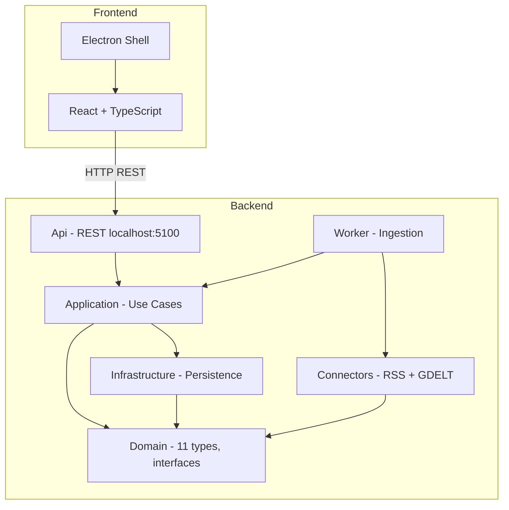
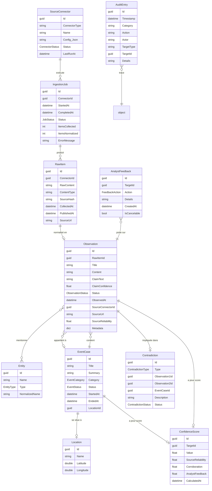
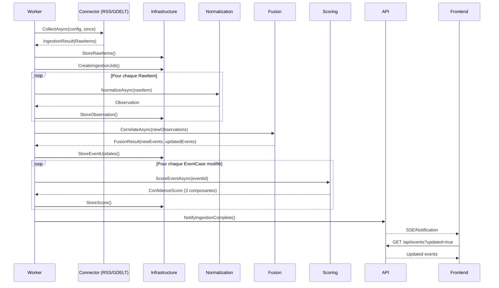
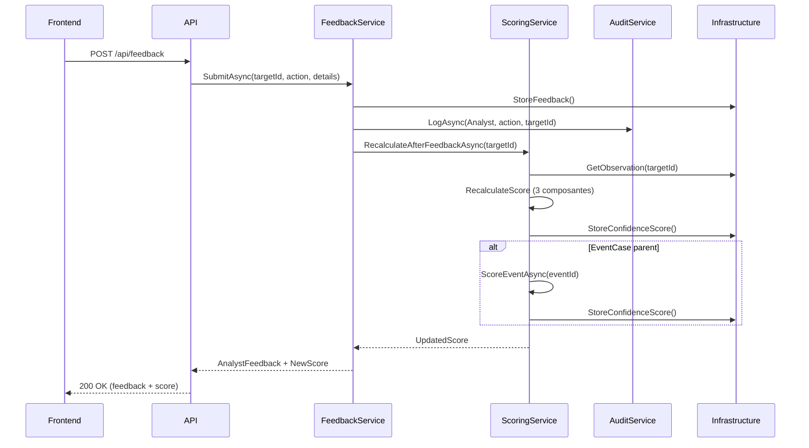

# Aegis Loop — Architecture technique

> **Version :** 2.0  
> **Statut :** Aligné V1 officielle — Spec-first  
> **Dernière mise à jour :** 2026-04-23  
> **Lien vers progression :** [02-architecture-technique.progress.md](02-architecture-technique.progress.md)  
> **Document amont :** [10-mvp-solo-v1-officiel.md](../review/10-mvp-solo-v1-officiel.md)  
> **Note :** Ce document est strictement aligné sur la V1 officielle. Tout écart est une erreur.

---

## 1. Principes d'architecture

### 1.1 Principes directeurs

| Principe | Application concrète |
|---|---|
| **SOLID** | S : une responsabilité par classe/module. O : extensibilité par connecteurs. L : interfaces substituables. I : interfaces fines. D : dépendances inversées vers les abstractions |
| **Séparation des préoccupations** | Domain / Application / Infrastructure / Presentation strictement séparés |
| **Composition over inheritance** | Préférence pour les services injectés et les stratégies, pas les hiérarchies profondes |
| **Dépendances inversées** | Le domaine ne dépend jamais de l'infrastructure. Les abstractions sont dans Domain |
| **Idempotence** | Normalisation, scoring et enrichissement sont idempotents |
| **Faible couplage** | Communication par interfaces et événements, pas par références directes entre modules |
| **Cohésion forte** | Chaque module a un rôle unique et clair |
| **Explicabilité** | Chaque score, chaque corrélation, chaque décision algorithmique est traçable et explicable |
| **Auditabilité** | Chaque action produit une entrée d'audit immutable |
| **Testabilité** | Le domaine est testable sans infrastructure, les connecteurs sont testables par contrat |

### 1.2 Anti-patterns à éviter

- Pas de logique métier dans les contrôleurs API
- Pas de dépendance directe du domaine vers EF Core ou SQLite
- Pas de référence circulaire entre modules
- Pas de singleton mutable partagé
- Pas de logique métier dans le frontend
- Pas de microservices pour faire moderne
- Pas d'abstraction prématurée — mais interfaces aux points d'extension identifiés

---

## 2. Choix de stack

### 2.1 Stack retenue

| Couche | Technologie | Version | Justification |
|---|---|---|---|
| Shell desktop | Electron | 41.3.0+ | Shell natif desktop, auto-update, menu système, icône barre des tâches |
| Frontend | React + TypeScript | React 19, TS 6.x | Écosystème riche, composants réutilisables, typage fort |
| UI Kit | Tailwind CSS + shadcn/ui | Dernière stable | Rapidité de développement, cohérence visuelle, densité informationnelle |
| Backend | C# / .NET | 10 | Performance, typage fort, écosystème mature, outillage excellent |
| API | ASP.NET Core Minimal APIs | 10.x | Léger, performant, pas de controller overhead |
| Communication | REST sur localhost | HTTP/1.1 | Simple, debuggable, pas de complexité gRPC pour IPC local |
| ORM | Entity Framework Core | 10.0.7 stable | Premier citoyen .NET, migrations, SQLite support |
| Persistance | SQLite | 3.x | Local, zero-config, pas de serveur, perf suffisante pour MVP |
| Carte | MapLibre GL JS | 4.x | Open source, performant, tuiles vectorielles |
| Tests unitaires | xUnit + FluentAssertions | Dernière stable | Standard .NET, assertions lisibles |
| Tests E2E | Playwright | Dernière stable | Multi-navigateur, intégré Electron |
| Build | dotnet CLI + npm | — | Standard, pas d'outil maison |
| CI | GitHub Actions | — | Natif GitHub, matrices de build |
| Documentation | Markdown | — | Dans le repo, versionné |
| Logs structurés | Serilog | 3.x | Sinks configurables, format structuré |

### 2.2 Pourquoi .NET 10

- La cible officielle AegisLoop V1 est `.NET 10` / `net10.0`.
- Le backend, l'API, le Worker, les tests et la CI doivent rester alignés sur .NET 10.
- EF Core + SQLite est conservé comme ORM ; aucune migration vers ADO.NET brut n'est prévue en V1.
- Les packages preview sont interdits lorsqu'une version stable compatible existe.

### 2.3 Pourquoi REST local (et pas gRPC)

- gRPC ajoute une couche de complexité pour un bénéfice négligeable sur localhost
- REST est debuggable avec un navigateur ou curl
- REST est compris par tout développeur frontend
- Les performances REST sur localhost sont amplement suffisantes

### 2.4 Pourquoi SQLite (et pas PostgreSQL ou fichier plat)

- Zero installation, zero configuration
- Parfait pour un desktop app mono-utilisateur
- EF Core supporte SQLite nativement
- Performances suffisantes pour 100k+ observations en local

---

## 3. Structure en projets — 6 projets C# + desktop-electron

### 3.1 Arborescence de repo

```
/
├── /src
│   ├── /AegisLoop.Domain                    # 11 types, invariants, interfaces
│   ├── /AegisLoop.Application               # Use cases, pipeline ingestion, fusion, scoring, feedback
│   ├── /AegisLoop.Infrastructure            # EF Core + SQLite, configuration, logging, géocodage
│   ├── /AegisLoop.Connectors                # RSS + GDELT (un seul projet pour 2 connecteurs)
│   ├── /AegisLoop.Api                       # REST Minimal APIs localhost (~20 endpoints)
│   ├── /AegisLoop.Worker                    # Service d'ingestion, host, planification
│   └── /desktop-electron                    # Shell Electron + React + TypeScript
├── /tests
│   ├── /AegisLoop.Domain.Tests
│   ├── /AegisLoop.Application.Tests
│   ├── /AegisLoop.Infrastructure.Tests
│   ├── /AegisLoop.Connectors.Tests
│   ├── /AegisLoop.Api.Tests
│   └── /AegisLoop.E2E.Tests
├── /docs
│   ├── /specs
│   ├── /adr
│   └── /review
├── /examples
│   └── /seed-data
├── /prompts
└── /publish
```

### 3.2 Responsabilités par projet

| Projet | Contenu | Justification |
|---|---|---|
| **AegisLoop.Domain** | 11 types, invariants, interfaces (ISourceConnector, IScoringService, etc.) | Séparation indispensable |
| **AegisLoop.Application** | Use cases, pipeline ingestion, fusion, scoring, feedback | Séparation indispensable |
| **AegisLoop.Infrastructure** | EF Core + SQLite, configuration, logging, géocodage | Séparation indispensable |
| **AegisLoop.Connectors** | RSS + GDELT (un seul projet pour 2 connecteurs) | 2 connecteurs = 1 projet suffit |
| **AegisLoop.Api** | REST Minimal APIs localhost (~20 endpoints) | Couche API |
| **AegisLoop.Worker** | Service d'ingestion, host, planification | Processus hôte |
| **desktop-electron** | Shell Electron + React + TypeScript | Frontend |

**Total backend : 6 projets C#** (au lieu de 14 dans l'ancienne V1). Les modules Fusion, Scoring, CaseManagement sont intégrés dans Application. Les DTOs sont dans Application (pas de projet Contracts séparé). L'interface ISourceConnector est dans Domain (pas de projet Abstractions séparé).

### 3.3 Diagramme de composants



---

## 4. Modèle de domaine — 11 types V1

### 4.1 Diagramme de relations domaine V1



### 4.2 Types du domaine — Définitions V1

#### SourceConnector
- **Responsabilité :** Connecteur configuré et actif (inclut la configuration)
- **Champs clés :** `Id`, `ConnectorType` (enum : Rss, Gdelt), `Name`, `Config` (JSON, polymorphique par type), `Status` (enum : Active, Inactive, Error, Paused), `LastRunAt`, `ErrorCount`
- **Invariant :** Un connecteur actif a toujours une configuration valide
- **Note V1 :** ConnectorConfiguration est fusionné dans SourceConnector (propriétés JSON), pas de type séparé.

#### RawItem
- **Responsabilité :** Donnée brute avant normalisation
- **Champs clés :** `Id`, `ConnectorId`, `RawContent` (texte brut), `ContentType` (xml, json, html, csv), `SourceHash` (SHA-256 pour déduplication), `CollectedAt`, `PublishedAt`, `SourceUrl`
- **Invariant :** Tout RawItem a un SourceHash non vide

#### Observation
- **Responsabilité :** Unité normalisée — centre de gravité du domaine
- **Champs clés :** `Id`, `RawItemId`, `Title`, `Content`, `ClaimText` (fusionné depuis Claim), `ClaimConfidence`, `Type` (Article, Report, GeospatialMetadata), `Status` (New, Confirmed, Invalidated, Contradicted), `ObservedAt`, `SourceConnectorId`, `SourceUrl`, `SourceReliability`, `Metadata` (dictionnaire extensible), `Language`, `GeoLocation` (nullable)
- **Invariant :** Toute observation est liée à un RawItem ou marquée comme entrée manuelle
- **Note V1 :** Claim fusionné dans Observation (champ ClaimText). Evidence n'existe pas en V1 (Observation = preuve).

#### Entity
- **Responsabilité :** Entité nommée extraite (Location, Organization, Person)
- **Champs clés :** `Id`, `Name`, `NormalizedName` (pour la fusion), `Type` (Location, Organization, Person), `Attributes` (dictionnaire extensible)
- **Invariant :** Le NormalizedName est toujours en minuscules, sans accents
- **Note V1 :** Pas de type Event ni Keyword. EntityLink repoussé en V2.

#### EventCase
- **Responsabilité :** Événement / dossier regroupant des observations
- **Champs clés :** `Id`, `Title`, `Summary`, `Category` (Conflict, Disaster, Political, Economic, Social, Environmental, Other), `Status` (Detected, Confirmed, InProgress, Closed, Archived, Invalidated), `StartedAt`, `EndedAt`, `LocationId` (nullable), `CorroborationCount`
- **Invariant :** Un EventCase a au moins 1 Observation

#### Location
- **Responsabilité :** Coordonnées géographiques
- **Champs clés :** `Id`, `Name`, `Latitude`, `Longitude`, `GeoJson` (nullable), `SourceType` (Geocoded, Manual, Native)
- **Invariant :** Latitude ∈ [-90, 90], Longitude ∈ [-180, 180]

#### Contradiction
- **Responsabilité :** Conflit entre observations (simplifié V1)
- **Champs clés :** `Id`, `Type` (Temporal, Factual, Geographic), `Observation1Id`, `Observation2Id`, `EventCaseId`, `Description`, `Status` (Open, Resolved, Dismissed)
- **Invariant :** Observation1Id ≠ Observation2Id
- **Note V1 :** Pas de workflow de résolution complexe, pas d'historique de résolution.

#### ConfidenceScore
- **Responsabilité :** Score explicable à 3 composantes
- **Champs clés :** `Id`, `TargetId`, `TargetType` (Observation, EventCase), `Value` (0.0–1.0), `SourceReliability` (0.0–1.0), `Corroboration` (0.0–1.0), `AnalystFeedback` (0.0–1.0), `CalculatedAt`, `AlgorithmVersion`
- **Invariant :** Value ∈ [0.0, 1.0]
- **Note V1 :** 3 composantes uniquement (FiabilitéSource, Corroboration, FeedbackAnalyste). Fraîcheur et Complétude exclues.

#### AnalystFeedback
- **Responsabilité :** Action de l'analyste (append-only après fenêtre)
- **Champs clés :** `Id`, `TargetId`, `TargetType`, `Action` (Confirm, Invalidate, Correct), `Details` (texte libre), `CreatedAt`, `IsCancelable` (true pendant 5 min)
- **Invariant :** Tout feedback est immutable après la fenêtre d'annulation (5 min)
- **Note V1 :** Pas d'action Merge, Split, Enrich (simplifié).

#### AuditEntry
- **Responsabilité :** Entrée du journal d'audit
- **Champs clés :** `Id`, `Timestamp`, `Category` (Ingestion, Normalization, Correlation, Scoring, Analyst, Configuration), `Action`, `Actor`, `TargetType`, `TargetId`, `Details`
- **Invariant :** Append-only, jamais modifié ni supprimé

#### IngestionJob
- **Responsabilité :** Trace d'une exécution de connecteur
- **Champs clés :** `Id`, `ConnectorId`, `StartedAt`, `CompletedAt`, `Status` (Planned, Running, Completed, Failed, Cancelled), `ItemsCollected`, `ItemsNormalized`, `ErrorMessage`

### 4.3 Types exclus V1

| Type | Destination | Raison |
|---|---|---|
| Claim | Fusionné dans Observation (champ ClaimText) | Redondant en V1 |
| Evidence | Fusionné dans Observation | Observation = preuve en V1 |
| MediaAsset | V2 | Pas de connecteur média en V1 |
| SearchQuery | V2 | Recherche avancée repoussée |
| EntityLink | V2 | Enrichissement V2 |
| Watchlist | V2 | Complexe à implémenter |
| ReportExport | DTO Application | Pas de type domaine séparé |
| ConnectorConfiguration | Propriétés de SourceConnector | 2 connecteurs = pas besoin de type séparé |

---

## 5. Interfaces majeures V1

### 5.1 ISourceConnector

```csharp
public interface ISourceConnector
{
    string ConnectorType { get; }
    Task<ValidationResult> ValidateConfigAsync(string configJson);
    Task<IngestionResult> CollectAsync(string configJson, DateTime? since);
    Task<HealthCheckResult> HealthCheckAsync(string configJson);
}

public record IngestionResult(
    bool Success,
    int ItemsCollected,
    IReadOnlyList<RawItem> Items,
    IReadOnlyList<string> Errors
);
```

### 5.2 INormalizationService

```csharp
public interface INormalizationService
{
    Task<NormalizationResult> NormalizeAsync(RawItem rawItem);
}

public record NormalizationResult(
    bool Success,
    Observation? Observation,
    string? ErrorMessage
);
```

### 5.3 IFusionEngine

```csharp
public interface IFusionEngine
{
    Task<FusionResult> CorrelateAsync(IEnumerable<Observation> observations);
}
```

### 5.4 IScoringService

```csharp
public interface IScoringService
{
    Task<ConfidenceScore> ScoreObservationAsync(Guid observationId);
    Task<ConfidenceScore> ScoreEventAsync(Guid eventCaseId);
    Task RecalculateAfterFeedbackAsync(Guid targetId, ScoreTargetType targetType);
}
```

### 5.5 IAnalystFeedbackService

```csharp
public interface IAnalystFeedbackService
{
    Task<AnalystFeedback> SubmitAsync(Guid targetId, FeedbackAction action, string? details);
    Task<bool> CancelAsync(Guid feedbackId);
    Task<IReadOnlyList<AnalystFeedback>> GetHistoryAsync(Guid targetId);
}
```

### 5.6 IAuditService

```csharp
public interface IAuditService
{
    Task LogAsync(AuditCategory category, string action, Guid? targetId, string? targetType, object? details);
    Task<IReadOnlyList<AuditEntry>> QueryAsync(AuditQuery query);
    Task ExportAsync(string filePath);
}
```

### 5.7 IGeocodingService

```csharp
public interface IGeocodingService
{
    Task<Location?> GeocodeAsync(string placeName);
    Task<string?> ReverseGeocodeAsync(double latitude, double longitude);
}
```

---

## 6. Flux de données

### 6.1 Cycle d'ingestion — Diagramme de séquence



### 6.2 Feedback analyste — Diagramme de séquence



---

## 7. Pipeline de normalisation — Détail

### 7.1 Étapes du pipeline (V1)

```
RawItem
  │
  ├── 1. Parsing (format-spécifique)
  │     RSS → SyndicationFeed → champs
  │     GDELT → CSV/JSON → champs
  │
  ├── 2. Mapping vers Observation
  │     Titre, contenu, date, URL, langue
  │     Champs non mappés → Metadata
  │     ClaimText extrait du contenu
  │
  ├── 3. Enrichissement
  │     3a. Détection d'entités (dictionnaire + regex)
  │     3b. Géocodage (Nominatim + cache)
  │
  ├── 4. Déduplication
  │     Hash du contenu normalisé + source
  │     Si doublon → marquer RawItem comme dupliqué
  │
  └── 5. Persistance
        Observation + Entities + ConfidenceScore
```

> **Note V1 :** Pas de parsing YouTube ni STAC (connecteurs V2). Pas d'import manuel CSV/JSON/GeoJSON/KML.

### 7.2 Stratégie de géocodage

**Approche V1 :** Nominatim (OSM) avec cache local.

- Les noms de lieux détectés sont résolus via l'API Nominatim (respect du Fair Use : 1.1s entre les requêtes)
- Les résultats sont mis en cache dans SQLite (table `GeocodeCache`) avec TTL 30 jours
- En mode démo ou offline, le cache est pré-rempli
- Si Nominatim est indisponible, les lieux non résolus restent sans coordonnées

**Approche V2 (future) :** Géocodeur local embarqué (GeoNames database locale).

---

## 8. Stratégie de corrélation / fusion V1

### 8.1 Algorithme de clustering

```
Entrée : Nouvelles observations (depuis dernière ingestion)
Sortie : Événements créés / mis à jour

Pour chaque nouvelle observation O :
  1. Calculer la similarité avec chaque observation existante :
     sim = α × SimilaritéTextuelle(O, Oi)
         + β × ProximitéTemporelle(O, Oi)
         + γ × ProximitéGéographique(O, Oi)
         + δ × EntitésCommunes(O, Oi)

  2. Si sim > seuil_cluster (défaut 0.6) :
     Ajouter O à l'EventCase de Oi

  3. Si O ne correspond à aucun EventCase existant :
     Créer un nouveau cluster candidat

  4. Si un cluster candidat atteint ≥ 2 observations de ≥ 2 sources :
     Promouvoir en EventCase avec status=Detected

Paramètres configurables :
  - seuil_cluster : 0.4–0.8 (défaut 0.6)
  - fenêtre_temporelle : 1–168h (défaut 24h)
  - rayon_géographique : 10–500km (défaut 50km)
  - poids α,β,γ,δ : configurables
  - min_observations : 2
  - min_sources : 2
```

### 8.2 Détection de contradictions V1

```
Pour chaque paire d'observations (O1, O2) dans un même EventCase :
  Si O1.Source ≠ O2.Source ET :
    - |O1.ObservedAt - O2.ObservedAt| < fenêtre ET
    - (O1.Location ≠ O2.Location avec > 100km) → Contradiction géographique
    - (O1.ClaimText ≠ O2.ClaimText sur le même sujet) → Contradiction factuelle
    - (dates incompatibles sur le même fait) → Contradiction temporelle
  Alors : Créer Contradiction(O1, O2, type, description)
```

---

## 9. Stratégie de scoring — 3 composantes V1

Voir [10-mvp-solo-v1-officiel.md](../review/10-mvp-solo-v1-officiel.md) section 5 pour le modèle de scoring officiel.

**Formule V1 :**

```
Score = W1 × FiabilitéSource + W2 × Corroboration + W3 × FeedbackAnalyste
```

| Composante | Plage | Poids défaut |
|---|---|---|
| FiabilitéSource | 0.0–1.0 | 0.35 |
| Corroboration | 0.0–1.0 | 0.35 |
| FeedbackAnalyste | 0.0–1.0 | 0.30 |

**Implémentation technique :**

```csharp
public class ConfidenceScoringService : IScoringService
{
    private readonly ScoringWeights _weights; // W1=0.35, W2=0.35, W3=0.30
    private readonly ISourceReliabilityRegistry _reliabilityRegistry;

    public async Task<ConfidenceScore> ScoreObservationAsync(Guid observationId)
    {
        var obs = await _repo.GetObservationAsync(observationId);
        var components = new Dictionary<string, double>();

        components["SourceReliability"] = _reliabilityRegistry.GetScore(obs.SourceConnectorType);
        components["Corroboration"] = CalculateCorroboration(obs);
        components["AnalystFeedback"] = CalculateFeedbackScore(obs);

        var score = _weights.W1 * components["SourceReliability"]
                  + _weights.W2 * components["Corroboration"]
                  + _weights.W3 * components["AnalystFeedback"];

        return new ConfidenceScore(obs.Id, ScoreTargetType.Observation,
            Math.Clamp(score, 0.0, 1.0), components);
    }
}
```

> **Exclus V1 :** Fraîcheur (→ tri, pas un score de confiance), Complétude/Spécificité (trop subjectif à calibrer).

---

## 10. Stratégie de persistance V1

### 10.1 Schéma SQLite — Tables principales (11 types)

| Table | Correspondance domaine |
|---|---|
| `SourceConnectors` | SourceConnector (inclut Config JSON) |
| `IngestionJobs` | IngestionJob |
| `RawItems` | RawItem |
| `Observations` | Observation (inclut ClaimText) |
| `Entities` | Entity |
| `EventCases` | EventCase |
| `Locations` | Location |
| `Contradictions` | Contradiction |
| `ConfidenceScores` | ConfidenceScore |
| `AnalystFeedbacks` | AnalystFeedback |
| `AuditEntries` | AuditEntry |
| `Notes` | Note |
| `Tags` | Tag |
| `TagAssignments` | TagAssignment (many-to-many) |
| `GeocodeCache` | Cache de géocodage |
| `ScoringWeights` | Configuration des poids de scoring |
| `AppSettings` | Paramètres applicatifs (key-value) |

> **Tables supprimées V1 :** EntityLinks, Watchlists, WatchlistMatches, SearchQueries, ReportExports, Evidences, Claims, MediaAssets. ClaimText est un champ dans Observations. Config est JSON dans SourceConnectors.

### 10.2 Stratégie EF Core

- **Approche Code-First** avec migrations EF Core
- Chaque migration est versionnée et nommée explicitement
- Les données seed sont injectées via un seeder dédié
- Les requêtes sont en LINQ, pas de SQL brut sauf exception documentée
- Les index sont définis sur : `SourceHash` (dédup), `ObservedAt` (timeline), `SourceConnectorId` (filtrage), `GeoLocation` (recherche géo), `NormalizedEntityName` (fusion)

### 10.3 Stratégie de migration de données

- EF Core Migrations pour les changements de schéma
- Pas de migration de données complexes en V1 — la base est recréable en mode démo
- Sauvegarde automatique de la DB avant chaque migration (copie .bak)

### 10.4 Taille et performance

- Objectif : < 500 MB de base pour 100k observations
- Purge configurable des RawItems anciens (> 90 jours par défaut)
- VACUUM SQLite mensuel automatique
- Index couvrants pour les requêtes fréquentes

---

## 11. Stratégie de cache

| Donnée | Stratégie | TTL | Invalidation |
|---|---|---|---|
| Géocodage Nominatim | Cache SQLite | 30 jours | Par entrée |
| Tuiles cartographiques | Cache disque local | 7 jours | Par tuile |
| Scores de confiance | Cache mémoire + DB | Aucun (recalcul) | Sur feedback ou nouvelle ingestion |
| Configuration connecteurs | Cache mémoire | Aucun | Sur modification |
| Résumés d'événements | Cache mémoire | 1 min | Sur modification d'observations |

---

## 12. Stratégie connecteurs V1

### 12.1 Architecture connecteur

```
┌──────────────────────────────────┐
│       AegisLoop.Connectors        │
│   ISourceConnector (interface)    │
│   IngestionResult                 │
│   HealthCheckResult                │
└──────────┬───────────────────────┘
           │ implements
     ┌─────┴──────┐
     │             │
┌────┴────┐ ┌────┴─────┐
│   RSS   │ │  GDELT    │
│  Feed   │ │  API v2   │
└─────────┘ └───────────┘
```

> **Note V1 :** Un seul projet `AegisLoop.Connectors` pour 2 connecteurs. Pas de projets séparés. Pas de YouTube, pas de STAC (V2).

### 12.2 Rate limiting concret

| Connecteur | Limite | Stratégie |
|---|---|---|
| RSS/Atom | 1 req/15min par flux | ETag + Last-Modified pour requêtes conditionnelles |
| GDELT API v2 | 60 req/min (marge de sécurité) | Throttling côté client |

### 12.3 Stratégie retry

- **Exponentiel :** 1-2-4-8-16s entre les tentatives
- **Circuit breaker :** 3 échecs consécutifs sur 5 minutes → pause du connecteur
- **Journalisation :** Chaque échec est tracé dans AuditEntry

### 12.4 Contrat de connecteur

Chaque connecteur DOIT :
- Implémenter `ISourceConnector`
- Gérer le rate limiting de sa source
- Gérer les erreurs réseau avec retry
- Retourner des RawItems au format standardisé
- Fournir un `HealthCheckResult` pour le monitoring
- Documenter ses paramètres de configuration (JSON)

---

## 13. IPC Electron ↔ .NET

### 13.1 Architecture IPC

```
┌────────────────────┐       HTTP REST        ┌───────────────────┐
│   Electron Shell   │ ◄─────────────────────► │  .NET API Server  │
│   (React + TS)     │    localhost:5100       │  (ASP.NET Core)   │
│                    │                         │                   │
│  - Menu système    │  SSE (notifications)   │  - Minimal APIs   │
│  - Auto-update     │ ◄─────────────────────  │  - Static files   │
│  - File dialogs    │                         │                   │
│  - System tray     │                         │                   │
└────────────────────┘                         └───────────────────┘
```

### 13.2 Cycle de vie Electron ↔ .NET

1. **Démarrage :** Electron spawn le processus .NET (`AegisLoop.Api`), attend le health check sur `/health` (timeout 30s), ouvre le BrowserWindow
2. **Arrêt :** Electron envoie SIGTERM, attend la grâce (10s max), kill si nécessaire
3. **Crash backend :** Electron affiche un écran d'erreur avec bouton "Redémarrer le backend"
4. **Port conflict :** Port par défaut 5100, si occupé → essai 5101-5110, si échec → erreur
5. **Mode démo :** Le backend peut démarrer sans réseau, les seed data sont embarquées
6. **Health check :** GET `/health` toutes les 30s, timeout 5s

### 13.3 Format d'échange

- **Requêtes :** JSON sur REST
- **Réponses :** JSON avec enveloppe standardisée :
```json
{
  "success": true,
  "data": { ... },
  "error": null,
  "meta": { "totalCount": 42, "page": 1 }
}
```
- **Notifications :** Server-Sent Events (SSE) sur `/api/events/stream` pour les mises à jour temps réel

### 13.4 Endpoints API V1 — ~20 endpoints

| Endpoint | Méthode | Description |
|---|---|---|
| `/health` | GET | Health check |
| `/api/events` | GET | Liste événements (paginée, filtrable) |
| `/api/events/{id}` | GET | Détail événement |
| `/api/events` | POST | Créer événement |
| `/api/events/{id}` | PATCH | Mettre à jour événement |
| `/api/observations` | GET | Liste observations |
| `/api/observations/{id}` | GET | Détail observation |
| `/api/observations/{id}/provenance` | GET | Provenance complète |
| `/api/feedback` | POST | Soumettre feedback (valider/invalider/corriger) |
| `/api/connectors` | GET | Liste connecteurs |
| `/api/connectors/{id}` | GET | Statut connecteur |
| `/api/connectors` | POST | Configurer connecteur |
| `/api/ingestion/run` | POST | Lancer collecte manuelle |
| `/api/ingestion/jobs` | GET | Historique jobs |
| `/api/ingestion/jobs/{id}` | GET | Détail job |
| `/api/scoring/{id}/breakdown` | GET | Décomposition du score |
| `/api/dashboard` | GET | KPIs et données dashboard |
| `/api/export/{id}` | GET | Export Markdown ou JSON |
| `/api/demo/load` | POST | Charger seed data |
| `/api/demo/reset` | POST | Réinitialiser démo |
| `/api/events/stream` | GET | SSE — notifications temps réel |

> **Endpoints supprimés V1 :** Pas d'endpoints séparés pour Entity, Location, AuditEntry, Watchlist, SearchQuery, CaseFile. Pas de DELETE pour feedback (annulation via POST). Pas de PUT/PATCH pour contradictions (résolution manuelle). Pas de `/api/search` avancé. Pas de `/api/cases` (EventCase = case file en V1). Pas de `/api/map/observations` (intégré dans `/api/observations` avec filtres géo).

---

## 14. Sécurité locale

### 14.1 Mesures de sécurité

| Mesure | Implémentation |
|---|---|
| API locale | Bindée sur localhost uniquement, pas d'exposition réseau |
| CORS | Restreint à l'origine Electron uniquement |
| Validation des entrées | Sur le backend ET le frontend |
| SQL Injection | EF Core avec paramétrage (pas de SQL brut) |
| XSS | React échappe par défaut, Content-Security-Policy |
| Audit | Journal append-only, non modifiable |
| Données sensibles | Marquage, avertissement à l'export |
| Mode démo | Données clairement séparées et marquées "DÉMO" |

### 14.2 Stratégie de secrets

- Pas de clé API requise en V1 (RSS et GDELT sont publics)
- Si des clés sont ajoutées en V2, elles seront chiffrées en local (AES) dans SQLite
- Pas de secrets dans le code source ou la configuration Git
- Un fichier `.env` local (ignoré par Git) peut contenir les clés pour le développement
- Le mode démo fonctionne sans aucune clé API

---

## 15. Observabilité

### 15.1 Logging structuré

- **Framework :** Serilog
- **Format :** JSON structuré
- **Sinks :** Console (développement), Fichier (production), SQLite (audit)
- **Niveaux :** Verbose (debug), Information (default), Warning, Error, Fatal
- **Contexte :** CorrelationId par ingestion job, SourceContext par module

### 15.2 Métriques locales

| Métrique | Source | Usage |
|---|---|---|
| Observations par connecteur | Ingestion | Monitoring connecteurs |
| Taux de normalisation | Normalization | Qualité pipeline |
| Nombre d'événements détectés | Fusion | Activité système |
| Score moyen de confiance | Scoring | Tendance qualité |
| Contradictions ouvertes | Contradiction | Charge analyste |
| Temps de collecte par connecteur | Ingestion | Performance |
| Taille de la base | Infrastructure | Maintenance |

### 15.3 Dashboard de santé

Intégré dans la vue Dashboard (Ctrl+1) :
- Statut de chaque connecteur
- Dernière collecte et prochain planning
- Taille de la base
- Nombre d'observations/événements
- Taux d'erreur

> **Note V1 :** Pas de vue "Système" séparée. Les informations de santé sont dans le Dashboard et dans Paramètres.

---

## 16. Packaging et déploiement

### 16.1 Build

```
dotnet publish src/AegisLoop.Api/AegisLoop.Api.csproj -c Release -o ./publish/api
cd src/desktop-electron && npm run build
```

### 16.2 Packaging Electron

- **electron-builder** pour le packaging
- Cibles : Windows (NSIS), macOS (DMG), Linux (AppImage)
- Le backend .NET est embarqué dans les ressources Electron
- Le package inclut les datasets seed de démo

### 16.3 Déploiement depuis GitHub

1. `git clone` le repo
2. Prérequis : .NET 10 SDK 10.0.201+, Node.js 24+, npm 11+
3. Backend : `dotnet restore AegisLoop.sln` puis `dotnet build AegisLoop.sln --configuration Release`
4. Tests backend : `dotnet test AegisLoop.sln --configuration Release --settings .runsettings`
5. Frontend : `cd src/desktop-electron && npm install && npm run build && npm test`
6. Desktop complet : `cd src/desktop-electron && npm run electron:dev`
7. API seule : `dotnet run --project src/AegisLoop.Api/AegisLoop.Api.csproj`
8. Worker seul : `dotnet run --project src/AegisLoop.Worker/AegisLoop.Worker.csproj`
9. Ou : télécharger la release précompilée depuis GitHub Releases

### 16.4 CI GitHub Actions

```yaml
# Workflows :
# 1. build.yml — Build + tests sur push/PR
# 2. release.yml — Package + release sur tag

Triggers :
  - push sur main → build + test
  - pull_request → build + test
  - tag v* → build + test + package + release

Matrice :
  - OS : windows-latest, ubuntu-latest, macos-latest
  - .NET : 10.0.x
  - Node : 24.x
```

### 16.5 État dépendances Phase 0C

- `Directory.Build.props` centralise `TargetFramework=net10.0`.
- EF Core SQLite/Design : `10.0.7` stable.
- Microsoft.Extensions.Hosting : `10.0.7` stable.
- Microsoft.AspNetCore.Mvc.Testing : `10.0.7` stable.
- Microsoft.NET.Test.Sdk : `18.4.0`, xUnit runner Visual Studio : `3.1.5`.
- Electron : `41.3.0`, Vite : `8.0.10`, Vitest : `4.1.5`, TypeScript : `6.0.3`.
- Aucun `NoWarn` ne masque `NU1903`.
- Commandes sécurité obligatoires : `dotnet list AegisLoop.sln package --vulnerable --include-transitive` et `npm audit --audit-level=low`.
- Baseline officielle de tests backend locale/CI : `dotnet test AegisLoop.sln --configuration Release --settings .runsettings`. La configuration Debug implicite n'est pas retenue comme baseline sur l'environnement Windows local lorsque Windows Code Integrity / Smart App Control bloque des assemblies Debug générées localement avec `0x800711C7`.

---

## 17. Stratégie de configuration

### 17.1 Sources de configuration (par ordre de priorité)

1. Paramètres par défaut dans le code (hardcoded defaults)
2. Fichier `appsettings.json` (base)
3. Fichier `appsettings.local.json` (overrides locaux, ignoré par Git)
4. Variables d'environnement (préfixe `AEGISLOOP_`)
5. Paramètres de ligne de commande

### 17.2 Configuration des connecteurs

Chaque connecteur a sa configuration stockée dans `SourceConnector.Config` (JSON) :

```json
// RSS
{
  "feedUrl": "https://feeds.lemonde.fr/mideast/rss.xml",
  "pollingIntervalMinutes": 15,
  "maxItemsPerPoll": 500
}

// GDELT
{
  "query": "sudan conflict",
  "countryFilter": "SU",
  "themeFilter": "CONFLICT",
  "pollingIntervalMinutes": 30,
  "maxItemsPerPoll": 500
}
```

---

## 18. Seed data V1

### 18.1 Scénario 1 — Crise au Soudan

- **50 observations** de 3 sources (RSS LeMonde, RSS BBC, GDELT)
- **5 événements** : Combats Khartoum, Déplacement populations, Coupure humanitaire, Déclarations diplomatiques, Incertitude sur le bilan
- **2 contradictions** : Bilan humain divergent, Localisation des combats
- Chaque observation : titre, contenu, source, date, localisation, score de fiabilité

### 18.2 Scénario 2 — Incident maritime Golfe d'Aden

- **40 observations** de 2 sources (RSS maritime, GDELT maritime)
- **3 événements** : Attaque navire commerce, Réponse internationale, Trafic maritime dévié
- **1 contradiction** : Nature de l'attaque (missile vs drone)
- Données géolocalisées avec coordonnées

**Total seed :** 90 observations, 8 événements, 3 contradictions.

---

## Références

- MVP Solo V1 Officiel : [10-mvp-solo-v1-officiel.md](../review/10-mvp-solo-v1-officiel.md)
- Plan de recentrage appliqué : [09-plan-de-recentrage-applique.md](../review/09-plan-de-recentrage-applique.md)
- Changelog du recentrage : [11-changelog-recentrage.md](../review/11-changelog-recentrage.md)